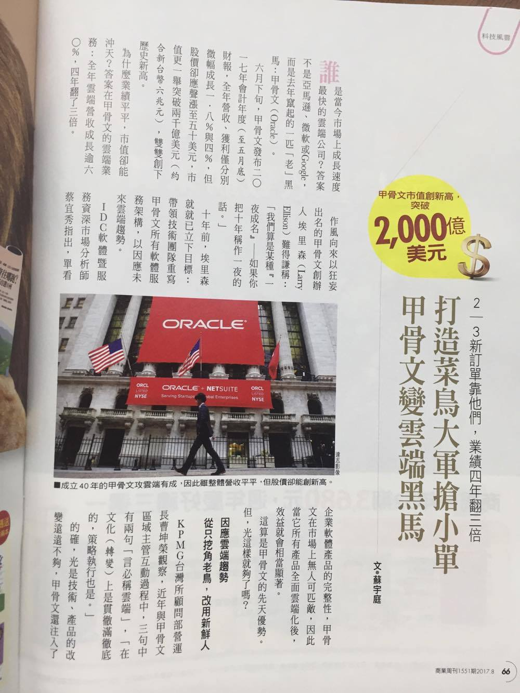
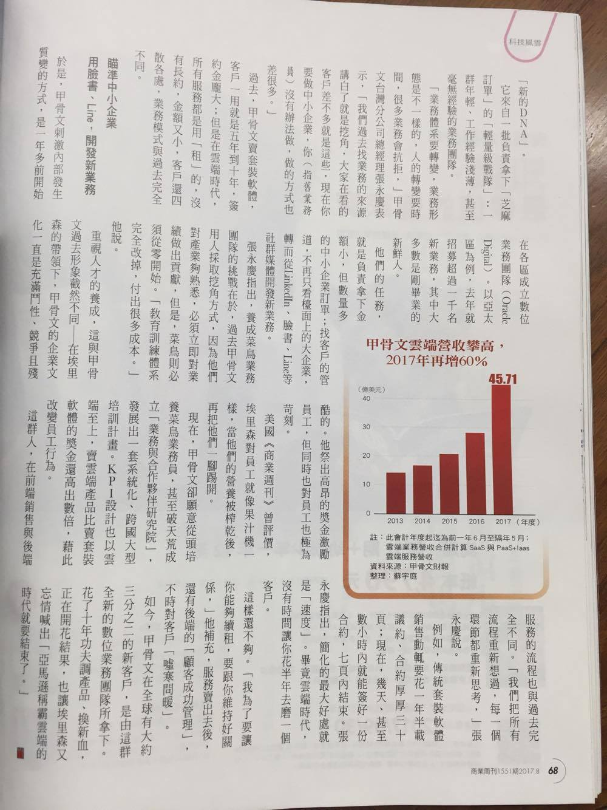

2017/08/24 - 打造菜鳥大軍搶小單，甲骨文變雲端黑馬
=====================================================================================

取自商業周刊1551期
-------------------

文章內容
````````````````






My notes
````````````

決策者真的很重要，若無法放下既有大公司的身段、將公司原本的文化和營運模式打破，是無法突破僵局看見未來的！