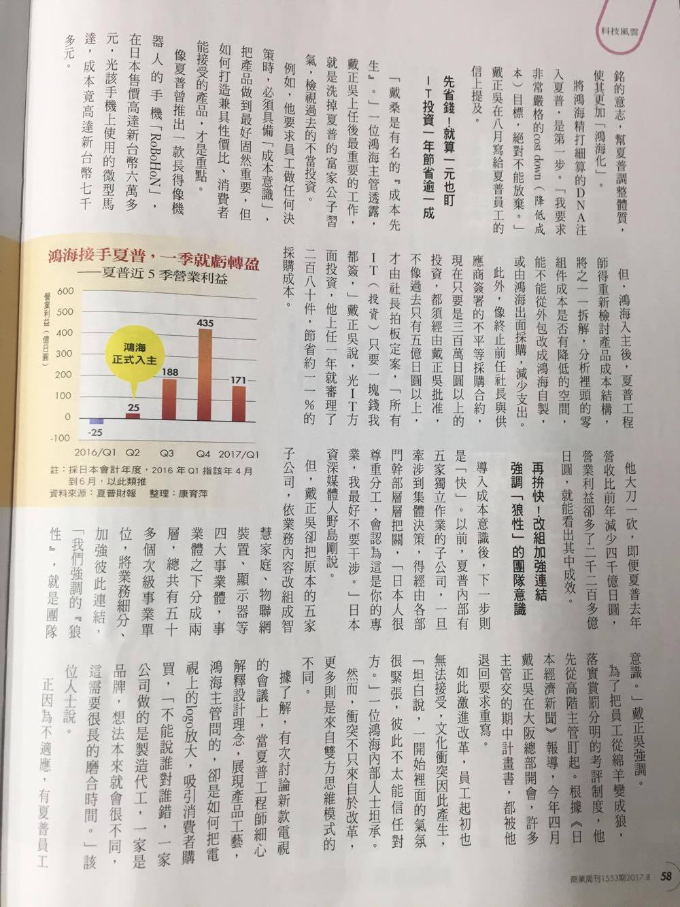
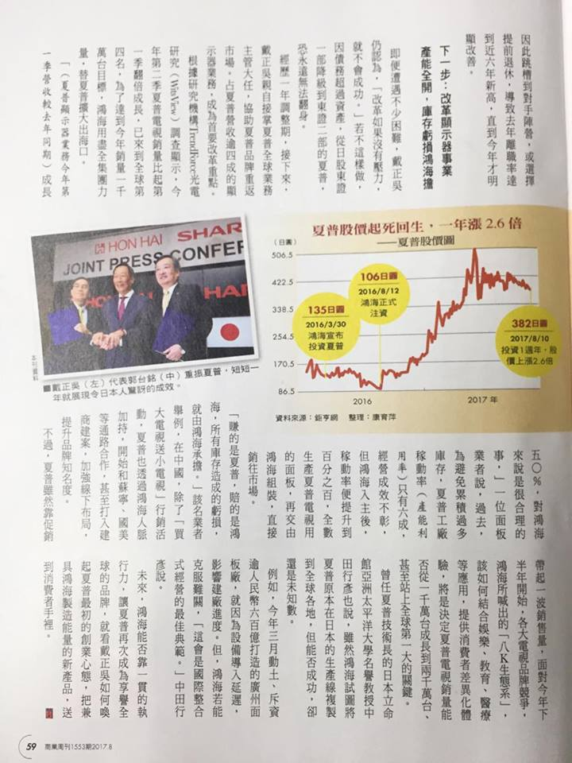

2017/08/31 - 入主一周年，戴正吳三招讓老店賺錢 - 「成本先生」翻轉夏普 把綿羊員工變成狼
============================================================================================================================================================================================================================

取自商業週刊第1553期
-----------------------------------

.. image:: Images/20170831-1.jpg

My notes
----------

戴正吳將鴻海式的管理制度引進夏普，將原本鬆散的老企業變成軍事化的經營，由這篇和之前一些的財經新聞已經知道很多夏普的老員工都無法承受這樣的轉變，進而離開或跳槽。但是戴正吳不會因此而改變強硬的作風，這樣的作法反而是一種篩選，只留下適合這套體系的員工，對長遠的公司規畫而言是好的。

除了體制上的改變，能夠將夏普轉虧為營最大的關鍵還是在**節流**，聽說之前夏普高級幹部只要出差，就會住五星級飯店，各式各樣的待遇增加了非必要的支出。對此，當戴正吳入主夏普時，竟然是住他們的員工宿舍，出公差的花費也是相當節省，以身作則讓所有下屬都不敢要求以往的優渥待遇，這樣累積起來就能夠節省很大的開銷。
