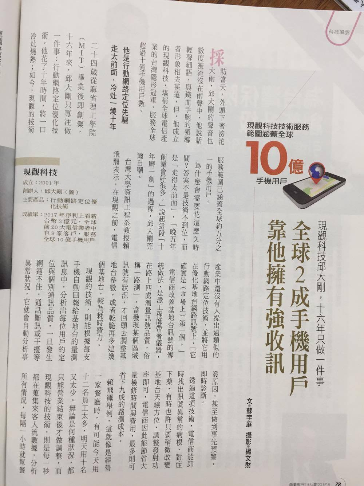

2017/09/11 - 全球2成手機用戶，靠他擁有強收訊
====================================================================================================

取自商業周刊第1554期
-----------------------------

.. image:: Images/20170911-2.jpg

My Notes
----------

我覺得文章中邱先生的這種視野以及毅力是非常厲害的，商業上確實都要取得先機，才能佔盡便宜，但是如何抓到未來趨勢就是一見非常困難的事情。像邱先生那樣沈寂這麼久還能堅持自己的理想，不隨波逐流、被現實生活壓力所打敗，想必是非常辛苦的。

成功不能只靠努力，還得靠機運，只要準備好，總有一天會找上你，只是不知道要多久。