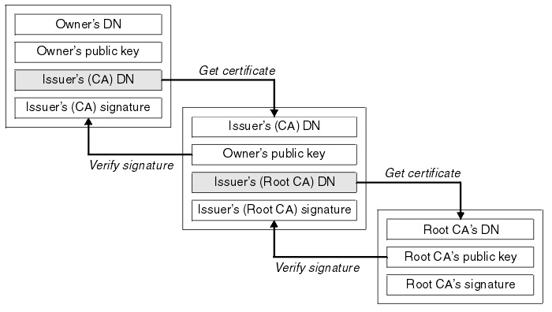

Certificate Chain
=======================

What is a Certificate Chain?
---------------------------------

- A certificate chain is **an ordered list of certificates**, containing an SSL/TLS Certificate and `Certificate Authority (CA)` Certificates, that enable the receiver to verify that the sender and all CA's are trustworthy. 
- The chain or path begins with the SSL/TLS certificate, and each certificate in the chain is signed by the entity identified by the next certificate in the chain.

Root CA Certificate
------------------------

The chain terminates with a Root CA Certificate.

The Root CA Certificate is always signed by the CA itself. The signatures of all certificates in the chain must be verified up to the Root CA Certificate.

Intermediate Certificate
--------------------------

- Any certificate that sits between the SSL/TLS Certificate and the Root Certificate is called a chain or Intermediate Certificate. 
- The Intermediate Certificate is the signer/issuer of the SSL/TLS Certificate. 
- The Root CA Certificate is the signer/issuer of the Intermediate Certificate. 
- If the Intermediate Certificate is not installed on the server (where the SSL/TLS certificate is installed) it may prevent some browsers, mobile devices, applications, etc. from trusting the SSL/TLS certificate. 
- In order to make the SSL/TLS certificate compatible with all clients, it is necessary that the Intermediate Certificate be installed.

Reference
----------------

- How Certificate Chains Work : https://knowledge.digicert.com/solution/SO16297.html
- How certificate chains work : https://www.ibm.com/docs/en/ibm-mq/9.0?topic=certificates-how-certificate-chains-work