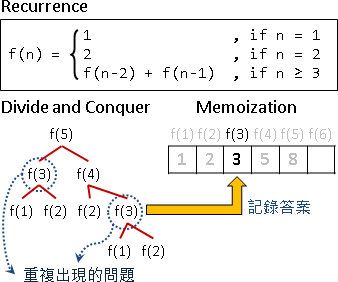
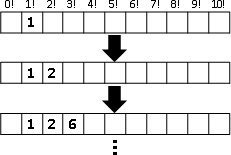

Dynamic Programming
========================

What is Dynamic Programming?
------------------------------

Dynamic Programming (DP)，是一個在解題很常用的一種解題方式，原理是透過把原問題分解為相對簡單的子問題的方式，來求解複雜問題的方法。

DP 在尋找有很多 **重疊子問題** 的情況的最佳解時有效，當遇到複雜的計算且有規律的問題時，我們可以使用動態規劃來將問題分解成數個小問題，找到其中的規律，每次將小問題的答案 **記錄** 下來，當下一回來用到前一回合答案時就直接查表，也可以說是一種 **用空間換取時間** 的解題方式。

Dynamic Programming = Divide-and-Conquer Method + Memoization

1. 把原問題遞迴分割成許多更小的問題。（recurrence）

   a. 子問題與原問題的求解方式皆類似。（optimal sub-structure）
   b. 子問題會一而再、再而三的出現。（overlapping sub-problems）

2. 設計計算過程：

   a. 確認每個問題需要哪些子問題來計算答案。（recurrence）
   b. 確認總共有哪些問題。（state space）
   c. 把問題一一對應到表格。（lookup table）
   d. 決定問題的計算順序。（computational sequence）
   e. 確認初始值、計算範圍。（initial states / boundary）

3. 實作，主要有兩種方式：
   
   a. Top-down
   b. Bottom-up

Example : Factorial 
+++++++++++++++++++++

1 × 2 × 3 × ⋯ × N 。整數 1 到 N 的連乘積，稱為 N 階乘，數學表示方式為 `N!`

陣列的每一格對應每一個問題。設定第一格的答案，再以迴圈依序計算其餘答案。

Reference
-------------------------------

https://web.ntnu.edu.tw/~algo/DynamicProgramming.html

https://medium.com/%E6%8A%80%E8%A1%93%E7%AD%86%E8%A8%98/%E6%BC%94%E7%AE%97%E6%B3%95%E7%AD%86%E8%A8%98%E7%B3%BB%E5%88%97-dynamic-programming-%E5%8B%95%E6%85%8B%E8%A6%8F%E5%8A%83-de980ca4a2d3