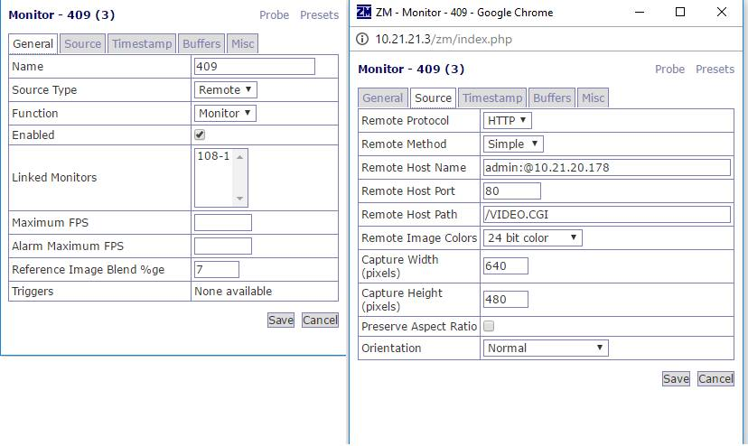
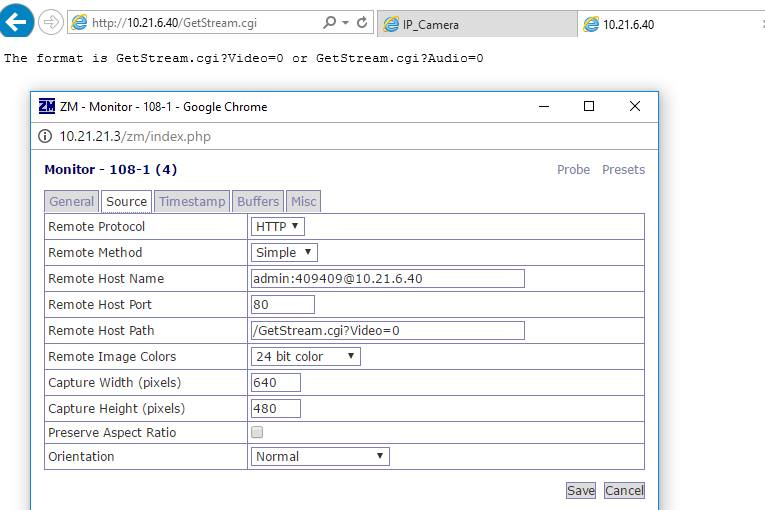

2016/11/12 - Report of using Zoneminder to connect IP Cameras
=============================================================

Introduction
------------

Today I try two IP Cameras : one is *D-Link DCS 910(at Lab 409)* and the other is *HLC-74ED( at 108 room)* , I want to use Zoneminder to connect them to prove that I have already understood how to control this complicated software.

Report of D-Link DCS 910 (IP address : 10.21.20.178 )
-----------------------------------------------------

I finally got its stream on Zoneminder via *HTTP/Simple* ! Here is the setting :

Success!

.. image:: Images/ya.png

Although I succeed in *HTTP*, *RTSP* is still in trouble. I found this device's **RTSP url** in this `website <http://www.soleratec.com/support/rtsp/rtsp_listing?camera_company=D-Link&camera_model=DCS-910>`_, but when I type **admin:@10.21.20.178** by *RTP/RTSP* method, log would show the error message : 'Response parse failure in '*HTTP/1.0 405 Method Not Allowed Allow: GET, HEAD 405 Method Not Allowed*' after the message "*Starting Capture*".

I think this old device dose not support *RTSP* protocol.

Report of Hunt HLC-74ED  ( IP address : 10.21.6.40) 
---------------------------------------------------

I found its *HTTP url* is **http\://10.21.6.40/GetStream.cgi?Video=0** or **/GetStream?Audio=0** , but I failed to get the stream. Here is the setting :

I notice that when I tpye this url on IE , it would start to download .cgi file, but there is nothing happen on Chrome.

And the part of *RTSP*, I can use this software **VLCProtable** to get its stream, but I failed on Zoneminder....

