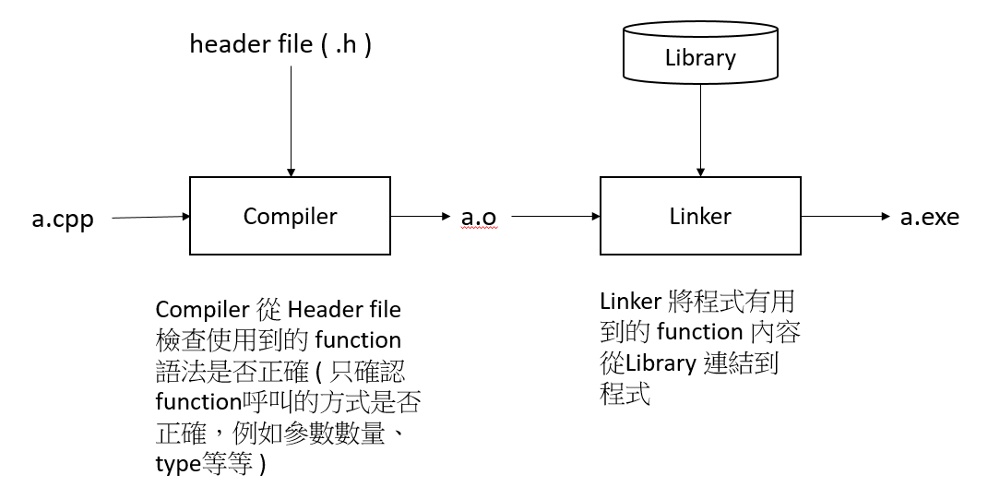

2016/12/15 - Dynamic Link Library
==================================

When a program is compiling...
-------------------------------

Abstract
--------

Dynamic linking is a mechanism that links applications to libraries at run time. The libraries remain in their own files and are not copied into the executable files of the applications. DLLs link to an application when the application is run, rather than when it is created. DLLs may contain links to other DLLs.

Many times, DLLs are placed in files with different extensions such as .exe, .drv or .dll.

Static Link vs Dynamic Link [#]_
----------------------------------
Static Link : Linker copys all library routines used in the program into the executable image while compiling.

    O : Faster

    X : Require more disk space and memory

Dynamic Link : Do not link the library routines while compiling until the image run, when both the executable and the library are placed in memory.

  X : Slow

  O : See the content below

Advantages of DLL [#]_
-----------------------

1. Uses fewer resources :

  DLL files don't get loaded into the RAM together with the main program; they don't occupy space unless required. When a DLL file is needed, it is loaded and run.

2. Promotes modular architecture

3. Aid easy deployment and installation

  When a function within a DLL needs an update or a fix, the deployment and installation of the DLL does not require the program to be relinked with the DLL. Additionally, if multiple programs use the same DLL, then all of them get benefited from the update or the fix.

  Applications and DLLs can link to other DLLs automatically, if the DLL linkage is specified in the IMPORTS section of the module definition file as a part of the compile. Else, you can explicitly load them using the Windows *LoadLibrary* function.

Types of DLLs [#]_
-------------------

When you load a DLL in an application, two methods of linking let you call the exported DLL functions. The two methods of linking are :
  - load-time dynamic linking
  - run-time dynamic linking

Load-time dynamic linking

  In load-time dynamic linking, an application makes explicit calls to the exported DLL functions like local functions. To use load-time dynamic linking, provide a *header* (.h) file and an import *library* (.lib) file, when you compile and link the application. When you do this, the linker will provide the system with the information that is required to load the DLL and resolve the exported DLL function locations at load time.

Runtime dynamic linking

  In runtime dynamic linking, an application calls either the LoadLibrary function or the *LoadLibraryEx* function to load the DLL at runtime. After the DLL is successfully loaded, you use the *GetProcAddress* function, to obtain the address of the exported DLL function that you want to call. When you use runtime dynamic linking, you do not need an import library file.

Write a Sample DLL
-------------------
In Microsoft Visual C++ 6.0, you can create a DLL by selecting either the Win32 Dynamic-Link Library project type or the MFC AppWizard (dll) project type.( It can refer to `reference [7] <http://vincecc.blogspot.tw/2013/10/cc-dll.html>`_  )

The following code is an example of a DLL that was created in Visual C++ by using the Win32 Dynamic-Link Library project type.

.. code-block:: c

  // SampleDLL.cpp

  #include "stdafx.h"
  #define EXPORTING_DLL
  #include "sampleDLL.h"

  BOOL APIENTRY DllMain( HANDLE hModule, DWORD  ul_reason_for_call, LPVOID lpReserved )
  {
   return TRUE;
  }

  void HelloWorld()
  {
   MessageBox( NULL, TEXT("Hello World"),
   TEXT("In a DLL"), MB_OK);
  }

.. code-block:: c

  // File: SampleDLL.h
  //
  #ifndef INDLL_H
  #define INDLL_H

   #ifdef EXPORTING_DLL
      extern __declspec(dllexport) void HelloWorld() ;
   #else
      extern __declspec(dllimport) void HelloWorld() ;
   #endif

  #endif

Calling a Sample DLL
---------------------

The following code is an example of a Win32 Application project that calls the exported DLL function in the SampleDLL DLL.

.. code-block:: c

  // SampleApp.cpp

  #include "stdafx.h"
  #include "sampleDLL.h"

  int APIENTRY WinMain(HINSTANCE hInstance, HINSTANCE hPrevInstance, LPSTR lpCmdLine, int nCmdShow)
  {
     HelloWorld();
     return 0;
  }

**NOTE** − In **load-time dynamic linking** ( the code above) , you must link the SampleDLL.lib import library that is created when you build the SampleDLL project.

In **runtime dynamic linking**, you use code that is similar to the following code to call the SampleDLL.dll exported DLL function.

.. code-block:: c

  ...
  typedef VOID (*DLLPROC) (LPTSTR);
  ...

  HINSTANCE hinstDLL;
  DLLPROC HelloWorld;
  BOOL fFreeDLL;

  hinstDLL = LoadLibrary("sampleDLL.dll");

  if (hinstDLL != NULL)
  {
   HelloWorld = (DLLPROC) GetProcAddress(hinstDLL, "HelloWorld");

   if (HelloWorld != NULL)
      (HelloWorld);

   fFreeDLL = FreeLibrary(hinstDLL);
  }
  ...

**NOTE** - In runtime dynamic link, *typedef VOID (*DLLPROC) (LPTSTR);* is necessary. [#]_

When you compile and link the SampleDLL application, the Windows operating system searches for the SampleDLL DLL in the following locations in this order :

  1. The application folder

  2. The current folder

  3. The Windows system folder (The GetSystemDirectory function returns the path of the Windows system folder).

  4. The Windows folder (The GetWindowsDirectory function returns the path of the Windows folder).

DLL - Registration
-------------------

In order to use a DLL, it has to be registered by having appropriate references entered in the Registry. It sometimes happens that a Registry reference gets corrupted and the functions of the DLL cannot be used anymore. The DLL can be re-registered by opening Start-Run and entering the following command::

  regsvr32 somefile.dll

This command assumes that somefile.dll is in a directory or folder that is in the PATH. Otherwise, the full path for the DLL must be used. A DLL file can also be unregistered by using the switch "/u" as shown below.
::

  regsvr32 /u somefile.dll

Reference
----------

.. [#] https://kb.iu.edu/d/akqn
.. [#]  http://dev.tutorialspoint.com/dll/dll_introduction.htm
.. [#]  http://dev.tutorialspoint.com/dll/dll_writing.htm
.. [#] How to Use DLL : http://www.tonylin.idv.tw/dokuwiki/doku.php/cpp:dll:windows:howtousedll
.. [#] Static vs Dynamic link library :  https://leterboy.wordpress.com/2009/10/26/static-link-dynamic-link-load/
.. [#] Windows 檔案安裝原理 : http://www.ithome.com.tw/node/59884

.. [#] MFC Create DLL : http://vincecc.blogspot.tw/2013/10/cc-dll.html
