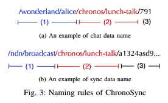
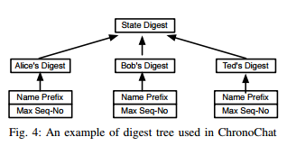
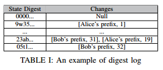

2017/05/04 - (Paper) Let's ChronoSync: Decentralized Dataset State Synchronization in Named Data Networking
================================================================================================================

Information
------------

IEEE ICNP 2013

Zhenkai Zhu and Alexander Afanasyev
University of California, Los Angeles

Full content : `Link <http://irl.cs.ucla.edu/~zhenkai/papers/chronosync.pdf>`_


Introduction
-------------

Named Data Networking (NDN) support multicast of data naturally.

ChronoSync is a protocol to synchronize dataset state among multiple parties in NDN.

NDN Architecture
-----------------

Communicationn units : *interest* packet and *data* packet.

All communication in NDN is receiver-driven => the only way for a data packet to be delivered is that a consumer explicitly sends out an interest requesting this data first.

When receiving an interest , router add an entry to the pending interest table(PIT) and recording the interface.

ChronoSync Design
------------------

Overview
`````````

.. image:: Images/ChronoSync_Overview.png

Two interdependent components of ChronoSync-based application

  1. ChronoSync module : Synchronize the state of the dataset

  2. The application logic module : Respond to the change of the dataset state.

A group text chat application based on ChronoSync : ChronoChat

To discover dataset change , The ChronoSync model of each ChronoChat instance sends out a *sync interest*, whose name contains the state digest that is maintained at the root of the digest tree.

*sync data* : reply *sync interest*

Naming rules
`````````````


Two sets of naming rules in ChronoSync :

  1. Application data names
  2. Sync data names.

Maintaining dataset state
``````````````````````````



The digest tree is always kept up-to-date to accurately reflect the current state of the dataset.



Each party keeps a *digest log* along with the digest tree.

Handling simultaneous data generations
```````````````````````````````````````
Problem : More than one data producer reply sync interest.

Solve : *Exclude filter*.

Wait time *wait timer (Tw)* times out, then send a sync interest again. Router would understand and reply another *sync data* back.

Handling network partitions
````````````````````````````

Send out *recoery interest* and who recognizes the unknown state digest reply the recovery reply with the most recent producer status of all users.

Evalution
-----------

ChronoChat vs IRC(based on TCP/IP)

1. ChronoChat's synchronization delay is lower.

2. If Packet lost rate <= 1% , ChronoChat stays pratically unaffected.

3. For any centralized implementation , like IRC , there is always a single of point of failure and the communication can get completely disrupted even with a small level of link failures. In contrast, ChronoChat can still work in divided small network.

4. In ChronoChat , every node in network has more or less equally utilization.


Conclusion (in this paper)
---------------------------

ChronoSync protocol removes both single point of failure and traffic concentration problems common associate with centralized implementations.

ChronoSync is highly robust in faces of packet losses, link failures, and network partitions.
