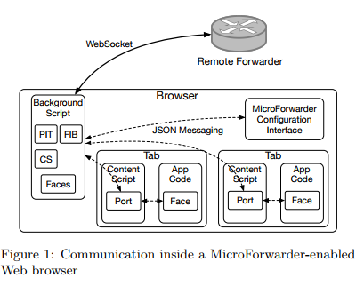

2017/09/11 - MicroForwarder.js: an NDN Forwarder Extension for Web Browsers
=============================================================================

Wentao Shang, UCLA

Jeff Thompson, UCLA

Jeff Burke, UCLA

`Full content is here. <http://conferences2.sigcomm.org/acm-icn/2016/proceedings/p201-shang.pdf>`_

Introduction
-------------

NDN.JS has quickly become one of the most popular NDN libraries both inside and outside the NDN community. However, there is a fundamental limitation in the design of the library that affects the usability of the NDN.JS applications: the dependency on the remote NDN forwarders.

Major drawbacks about NDN.JS apps rely on remote forwarder : 

    1. When a user opens multiple NDN.JS apps in different browser tabs, each tab will create its own WebSocket connection to the NDN network and consume resources on both the local machine and the remote forwarders.

    2. Each NDN.JS app has to implement its own logic for automatic discovery and failover of remote forwarders.

    3. When multiple NDN.JS apps request for the same data, that piece of data will be retrieved multiple times since there is no sharing of local data cache among the browser tabs

This WebExtensions  allows NDN.JS apps to communicate with the in-browser MicroForwarder through the WebExtensions messaging API and share the connectivity to the external NDN network and the local data cache. 

Design and implementation
----------------------------

Three major components : 

    1. A *background script* running the MicroForwarder logic. It implements the NDN packet forawrding logic, manages forwarding-related data structures such as PIT, FIB, and CS, and connects to remote forwarder via WebSocket.

    2. A *content script* implementing the communication interface to the MicroForwarder.

    3. A *configuration interface* for managing the runtime state of the MicroForwarder. From the configuration page the use can add connections to the remote NDN forwards and inspect the current forwarder status (Figure 2).

 

.. image:: Images/20170911_002.png

My Summary
-----------

I read this report because I found the MicroForwarder folder when I install NDN.JS, so I want to know what this program do.

MicroForwarder.js is a JavaScript implementation to decrease the burden of browser when there are multiple tabs in a same browser, and configure the remote forwarder in the extension instead of in program. 

That is, if you don't install this extension, you can also connect to the remote forwarder, but you have to remember to connect to the remote forwarder.

