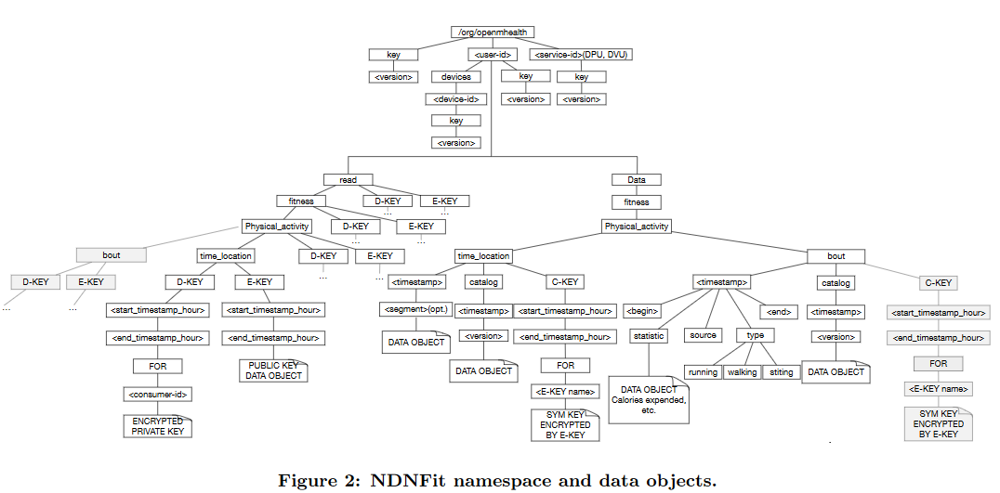
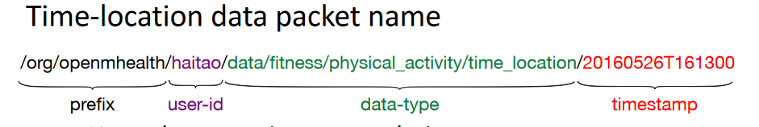
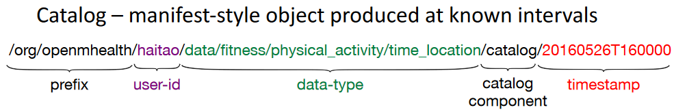

2017/11/20 - (Paper) Sharing mHealth Data via Named Data Network
====================================================================

Haitao Zhang, Zhehao Wang, Christopher Scherb, Claudio Marxer, Jeff Burke, Lixia Zhang

UCLA

Full Content : `Link <https://named-data.net/wp-content/uploads/2015/01/sharing_mhealth_data_ndn.pdf>`_

1. Introduction
-------------------

Both mHealth over TCP/IP and mHealth over NDN use named data for interoperability. Both of them seek to empower data owners to exercise control over their data without reliance on a particular medium.

Both mHealth and NDN use data exchange as **thin waist** architecture.

    .. image:: Images/20171120-1.PNG

However, mHealth is an application, but NDN is a network-level architecture. These requirements above could be satisfy in native NDN architecture.

2. Design of NDNFIT
----------------------

NDNFit was designed to offer end-users a familiar fitness tracking application that uses NDN to communicate.

2.1 Namespace design
``````````````````




- ``/org/openmhealth`` : Identify the echo system.

- ``<user-id>`` : User's one or more unique identifiers in thsi namespace.

- Each user namespace has 4 children that contains data on cryptographic identity, devices acting, data samples themselves, and read-authorization data for name-based access control, respectively : 

    1. ``key``

    2. ``devices``

    3. ``data``

    4. ``read``

Time-location : useing ``timestamp`` to enable Interests to be easily constructed to regrieve data for any given time intervals.


2.2 Application architecture
`````````````````````````````````````

- Data Storage Units(DSUs) : Repository for user's health data.

- Data Processing Units(DPUs) : Entrusted by users to consume raw data and produce derived data on demand.

- Data Visualization Units(DVUs) : Enable user to visualize and interact with their health data.

2.3 Data transport protocol [#]_
```````````````````````````````````





Consumers wishing to use catalogs send Interests to fetch the catalog first, extract the data names, then issue further Interests for the constituent Data packets.


2.4 Identify and trust management
```````````````````````````````````
Hierarchical relationship to be easily described and verified.

NDNFit has a preconfigured trust schema that can be published as named, signed data in the application ecosystem, enabling data consumers to consult the schema and verify any received data consistently, regardless of where it comes from or where it is stored,  eliminating the dependency on connection-based security. 

.. image:: Images/20171120-5.PNG


Reference
-------------

.. [#] NDNFit icn presentation v15 : http://conferences2.sigcomm.org/acm-icn/2016/slides/ShortPaperSession2/zhang.pdf